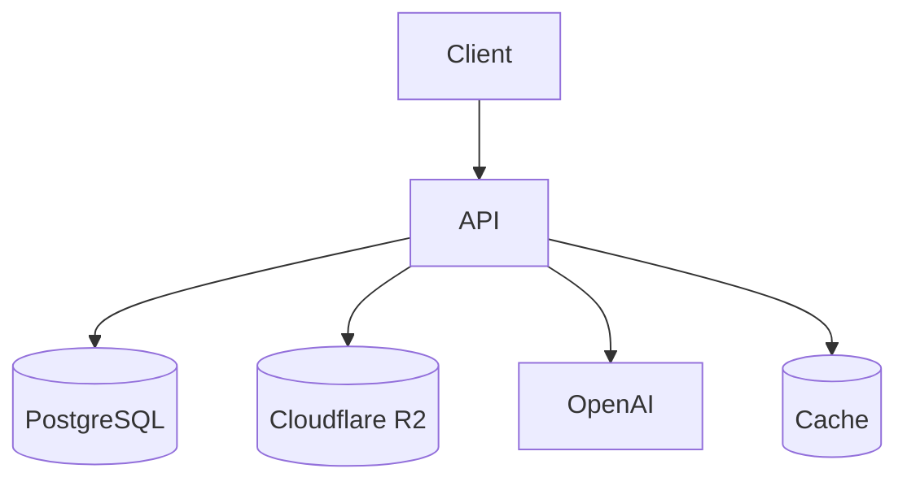
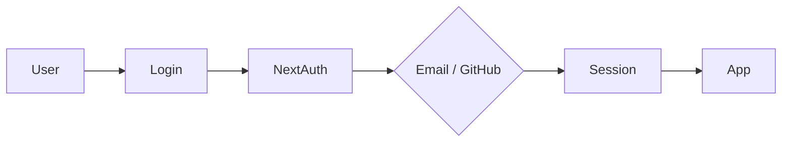
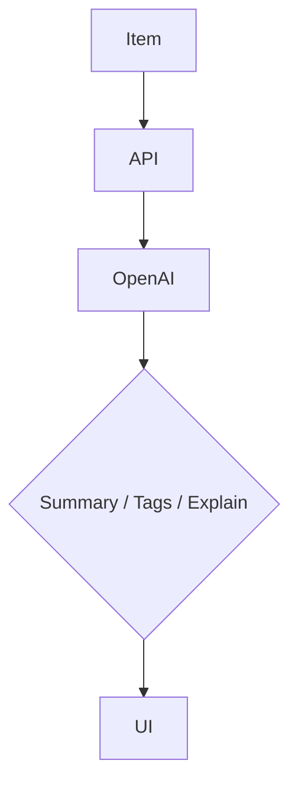

# 🚀 Devstash Project Specifications

> **Centralized Developer Knowledge Hub** for code snippets, and others

---

# 📌 Problem (Core Idea)

Developers keep their essentials scattered:

- Code snippets in VS Code or Notion
- AI prompts in chats
- Context files buried in projects
- Useful links in bookmarks
- Docs in random folders
- Commands in `.txt` files
- Project templates in GitHub Gists
- Terminal commands in bash history

This creates **context switching**, **lost knowledge**, and **inconsistent workflows**.

**DevStash provides one searchable, AI-powered hub for everything developers need.**

---

# 🧑‍💻 Users

| Persona | Needs |
|---------|-------|
| Everyday Developer | Quick access to snippets, commands, links |
| AI-First Developer | Store prompts, workflows, contexts |
| Content Creator / Educator | Save notes and reusable code |
| Full-Stack Builder | Patterns, boilerplates, API references |

---

# ✨ Core Features

## A. Item Types

Built-in item types:

- Snippet
- Prompt
- Note
- Command
- File
- Image
- URL

**Pro users** can create custom item types.

---

## B. Collections

Collections can contain any mix of item types.

Examples:

- React Patterns
- Context Files
- Python Snippets

---

## C. Search

Full-text search across:

- Content
- Title
- Tags
- Item Type

---

## D. Authentication

- Email & Password
- GitHub OAuth

---

## E. Additional Features

- Favorites
- Pin items
- Recently Used
- Markdown editor
- File uploads
- Import
- Export (JSON / ZIP)
- Dark mode by default

---

## F. AI Features

- Auto-tagging
- AI summaries
- Explain Code
- Prompt optimization

> Powered by **OpenAI GPT-5 Nano**

---

# 🗄️ Data Model

> Initial Prisma schema (will evolve).

```prisma
// Prisma schema...
```

---

# 🧱 Tech Stack

| Category | Choice |
|----------|--------|
| Framework | Next.js 19 |
| Language | TypeScript |
| Database | Neon PostgreSQL + Prisma |
| Cache | Redis (optional) |
| Storage | Cloudflare R2 |
| UI | Tailwind CSS v4 + shadcn/ui |
| Auth | NextAuth v5 |
| AI | OpenAI GPT-5 Nano |
| Deployment | Vercel |
| Monitoring | Sentry |

---

# 💰 Pricing

| Plan | Price | Limits | Features |
|------|-------|--------|----------|
| Free | $0 | 50 items, 3 collections | Search, images, basic features |
| Pro | $8/mo or $72/yr | Unlimited | AI, file uploads, custom types, export |

> Stripe handles subscriptions and webhooks.

---

# 🎨 UI / UX

- Dark mode first
- Developer-focused
- Syntax highlighting
- Inspired by **Notion**, **Linear**, and **Raycast**

### Layout

- Collapsible sidebar
- Grid/List workspace
- Full-screen editor

### Responsive

- Mobile drawer
- Touch-friendly controls

---

# 🔌 API Architecture



---

# 🔐 Authentication Flow



---

# 🧠 AI Flow



---

# 🗂️ Development Workflow

- One Git branch per lesson
- Cursor / Claude Code / ChatGPT for assistance
- Sentry monitoring
- GitHub Actions (optional)

Example:

```bash
git switch -c lesson-01-setup
```

---

# 🧭 Roadmap

## MVP

- CRUD Items
- Collections
- Search
- Tags
- Free tier limits

## Pro

- AI
- Custom item types
- File uploads
- Export
- Billing

## Future

- Shared collections
- Team plans
- VS Code extension
- Browser extension
- API
- CLI

---

# 📌 Current Status

- Planning complete
- Ready for environment setup
- Ready for UI scaffolding

---

# 🏗️ DevStash

**Store Smarter. Build Faster.**