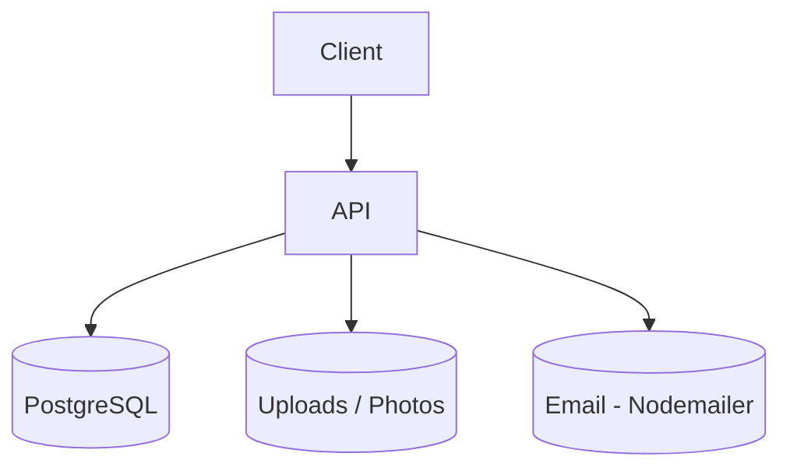
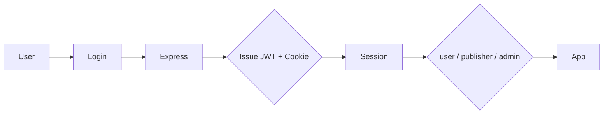
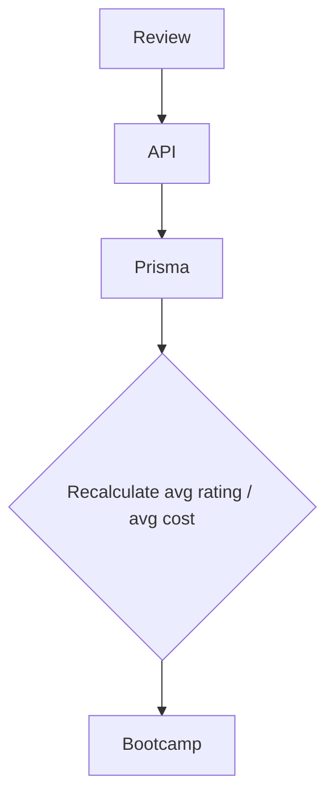

# 🎓 DevCamper Project Specifications

> **Centralized Bootcamp Discovery & Management Platform** for students, publishers, and admins

---

# 📌 Problem (Core Idea)

Prospective students researching coding bootcamps deal with scattered, unreliable information:

- Bootcamp details spread across marketing sites, forums, and review aggregators
- Course offerings and tuition buried in inconsistent PDFs or landing pages
- No way to filter bootcamps by location, cost, or career field in one place
- Reviews scattered across Reddit, Course Report, SwitchUp, etc., with no verified rating aggregation
- Bootcamp providers have no unified way to publish and manage their own listings
- No geospatial way to answer "what's near me?"

**DevCamper provides one searchable, structured API/platform for discovering, comparing, and managing coding bootcamps, their courses, and student reviews.**

---

# 🧑‍💻 Users

| Persona | Needs |
|---------|-------|
| Prospective Student | Compare bootcamps by location, cost, rating, career track |
| Career Changer | Filter courses by skill, tuition, and time commitment |
| Bootcamp Publisher | Create and manage bootcamp/course listings |
| Platform Admin | Moderate users, reviews, and bootcamp content |

---

# ✨ Core Features

## A. Resource Types

Built-in resource types:

- Bootcamp
- Course
- Review
- User

Roles attached to `User`: **user**, **publisher**, **admin** — access to write operations is role-gated (see endpoint tables below).


---

## B. Bootcamp ↔ Course Relationship

Where DevStash groups items into **Collections**, DevCamper groups **Courses** under a parent **Bootcamp**:

- Each Bootcamp can have many Courses
- Average course tuition and average review rating are aggregated back onto the Bootcamp record
- Bootcamps can be filtered/grouped conceptually by career track (Web Dev, Mobile Dev, UI/UX, Data Science, Business)

---

## C. Search & Query

Advanced query filtering across bootcamps and courses:

- Field selection, sorting, and pagination
- Filtering by comparison operators (e.g. `cost[lte]=10000`)
- **Geospatial search**: bootcamps within a given radius of a zip code (`/bootcamps/radius/:zipcode/:distance`)
- Slug-based lookup for clean URLs

---

## D. Authentication

- Email & Password (JWT-based, with secure cookie support)
- Role-based authorization: `user`, `publisher`, `admin`
- Password reset via emailed token (SMTP)

---

## E. Additional Features

- Photo uploads for bootcamps
- Average rating & average cost aggregation (auto-recalculated on review/course changes)
- Slug generation for bootcamp URLs
- Security hardening: Helmet, CORS, XSS sanitization, HTTP Param Pollution protection, rate limiting
- Interactive API documentation via Swagger UI

---

## F. AI Features *(proposed — not in current implementation)*

DevStash's AI layer (auto-tagging, summaries, explain-code) doesn't have an equivalent in the current DevCamper README. If DevCamper wanted an analogous AI layer, candidates would be:

- Bootcamp recommendation matching (based on student goals/budget/location)
- Review summarization per bootcamp ("what students say" digest)
- Auto-categorization of new bootcamp listings into career tracks

> Flagged as a **future roadmap item**, not a current feature — unlike DevStash, where AI is already core.

---

# 🗄️ Data Model

> Prisma schema (PostgreSQL via Neon) — core entities per the current API.

```prisma
// Bootcamp, Course, Review, User models
// (see existing schema.prisma — Bootcamp 1—N Course, Bootcamp 1—N Review, User 1—N Review)
```

---

# 🧱 Tech Stack

| Category | Choice |
|----------|--------|
| Runtime | Node.js v23 |
| Framework | Express.js v4 |
| Language | JavaScript (Node) |
| Database | Neon PostgreSQL + Prisma |
| Auth | JSON Web Tokens + bcryptjs |
| File Upload | express-fileupload / multer |
| Email | Nodemailer (SMTP) |
| Docs | Swagger UI + YAML spec |
| Security | Helmet, CORS, xss-clean, hpp, express-rate-limit |
| Dev Tooling | Nodemon |

> Compared to DevStash's Next.js/TypeScript/Prisma/Vercel stack, DevCamper is currently a **standalone REST API** (Express, not a full-stack framework) with no frontend, storage layer (R2), cache (Redis), or hosted AI provider wired in yet.

---

# 💰 Pricing *(not implemented — proposed analogy)*

The current DevCamper API has no monetization layer. If a DevStash-style tiering were introduced for bootcamp publishers:

| Plan | Price | Limits | Features |
|------|-------|--------|----------|
| Free | $0 | 1 bootcamp, 5 courses | Basic listing, reviews |
| Publisher Pro | TBD | Unlimited | Featured placement, analytics, priority support |

> This section is speculative — the source README does not mention billing, Stripe, or plan tiers. Include only if DevCamper is expanding into a monetized publisher model.

---

# 🎨 UI / UX *(future — API currently has no frontend)*

DevCamper is presently **backend-only** (REST API + Swagger docs). A future frontend, if built to mirror DevStash's design language, could adopt:

- Clean, card-based bootcamp listings (photo, rating, cost, location)
- Map view for geospatial radius search
- Review threads per bootcamp
- Publisher dashboard for managing bootcamps/courses
- Responsive layout for mobile browsing

---

# 🔌 API Architecture



---

# 🔐 Authentication Flow



---

# 🧠 Aggregation Flow (Reviews → Bootcamp Rating)



---

# 🗂️ Development Workflow

- One Git branch per feature/endpoint group
- Nodemon for local dev reload
- Swagger UI for endpoint testing/documentation
- (Optional, mirroring DevStash) GitHub Actions for CI, Sentry for monitoring — not currently in the README, worth adding if scaling

Example:

```bash
npm run dev
```

---

# 🧭 Roadmap

## MVP *(already implemented per README)*

- Auth (register/login/logout/JWT/roles)
- Bootcamps CRUD + geospatial search + photo upload
- Courses CRUD (linked to bootcamps) + tuition aggregation
- Reviews CRUD + rating aggregation
- Admin user management
- Swagger API docs
- Security middleware (Helmet, CORS, XSS, HPP, rate limiting)

## Pro / Next Phase

- Frontend client (student-facing + publisher dashboard)
- Publisher monetization tier
- File storage migration to cloud object storage (e.g. Cloudflare R2/S3)
- CI/CD + monitoring (GitHub Actions, Sentry)

## Future

- AI-powered bootcamp recommendations
- Review summarization
- Saved searches / alerts for new bootcamps
- Mobile app
- Public API for third-party bootcamp aggregators

---

# 📌 Current Status

- Backend REST API complete per current README
- Auth, Bootcamps, Courses, Reviews, Users all implemented
- Swagger docs live at `/api-docs`
- No frontend yet — ready for UI scaffolding
- No billing/AI layer yet — future consideration

---

# 🏗️ DevCamper

**Find the Right Bootcamp. Build the Right Career.**
